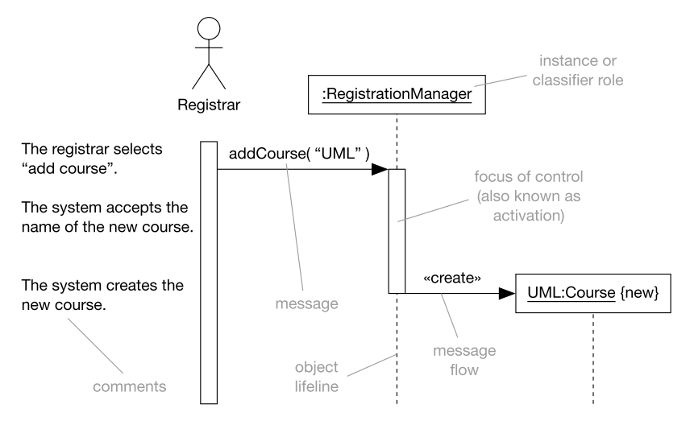
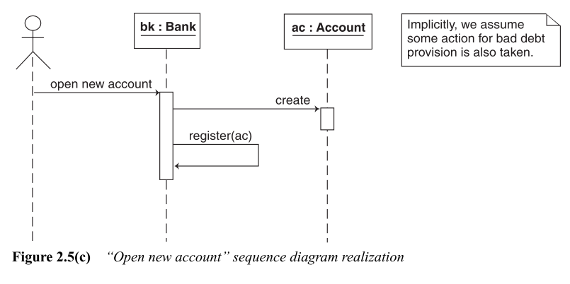

## Sequence Diagram
- A sequence diagram presents the objects that we are interested in when describing the use-case. 
- Sequence diagrams show object interactions arranged in a time sequence.
- They are isomorphic with collaboration diagrams and contain the same elements plus two others:
    - object lifeline
    - focus of control
- In sequence diagrams we can show focus of control, also known as activation, more clearly and explicitly
- Sequence diagrams also come in 
    - Descriptor form 
    - Instance form (Most widely used)
- A sequence diagram shows the sequence of messages that take place between interacting objects, with an emphasis on their time ordering.

- We present the objects at the top of the sequence diagram. Each object has an associated lifeline extending below it. The lifeline is the period of time during which the object plays its role in the sequence diagram.

## Sequence Diagram Descriptor

## Bank Account Example

## Sequence Diagram Guidelines

- The objects are shown as rectangular figures labelled with the object type and the object’s identifier.
- Objects are placed at the top of the sequence diagram.
- Time is understood to pass as we move vertically down through the diagram.
- The lifelines are decorated with activations (thin rectangular figures) that highlight where the object is actively involved in some processing like   executing a method.
- Between two activations we can show a message.
- A message is a request sent from a sender object to some recipient object to perform some processing action.
- 
