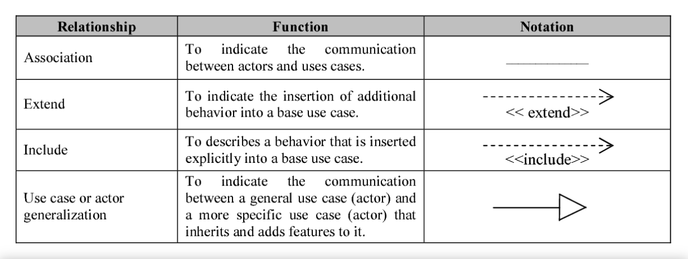
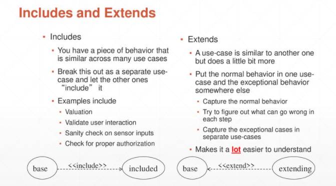
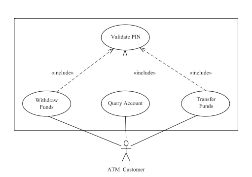
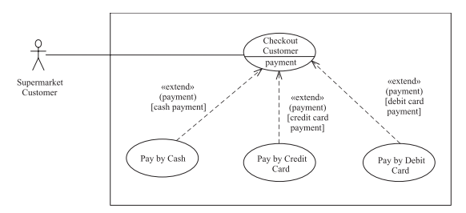
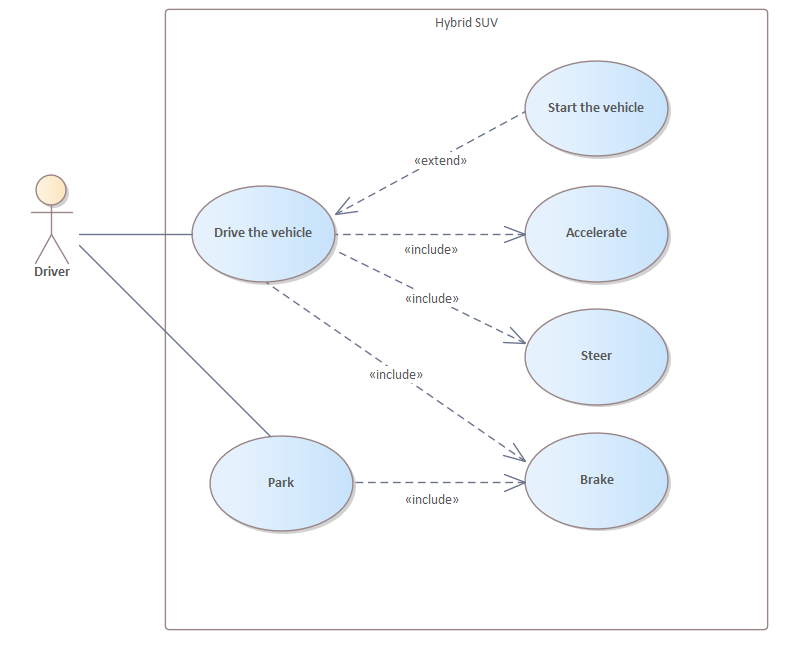

# UML

## Use Cases
- A use case defines a sequence of interactions between one or more actors and the system
- The use case model describes the functional requirements of the system in terms of the actors and use cases.
- The system is treated as a black box – that is, dealing with what the system does in response to the actor’s inputs, not the internals of how it does it.
- An actor provides inputs to the system and the system provides responses to the actor.

## Use Case Diagram Guidelines

### Actors

- Give meaningful business relevant names for actors
- Primary actors should be to the left side of the diagram
- Actors model roles (not positions)
- External systems are actors
- Actors don’t interact with other actors
- Place inheriting actors below the parent actor

### Use Cases
- Names begin with a verb
- Make the name descriptive
- Highlight the logical order
- Place included use cases to the right of the invoking use case 
- Place inheriting use case below parent use case

# Relationships

## Include

## Extend

## Driving Example

# Actors, Roles, and Users
# High-level Use Cases
| Syntax                |
| --------------------- |
| ID                    |
| Name                  |
| Sumary                |
| Actors                |
| Preconditions         |
| Main Sequence         |
| Alternative Sequences |
| Postconditions        |

# Requirements tracing

